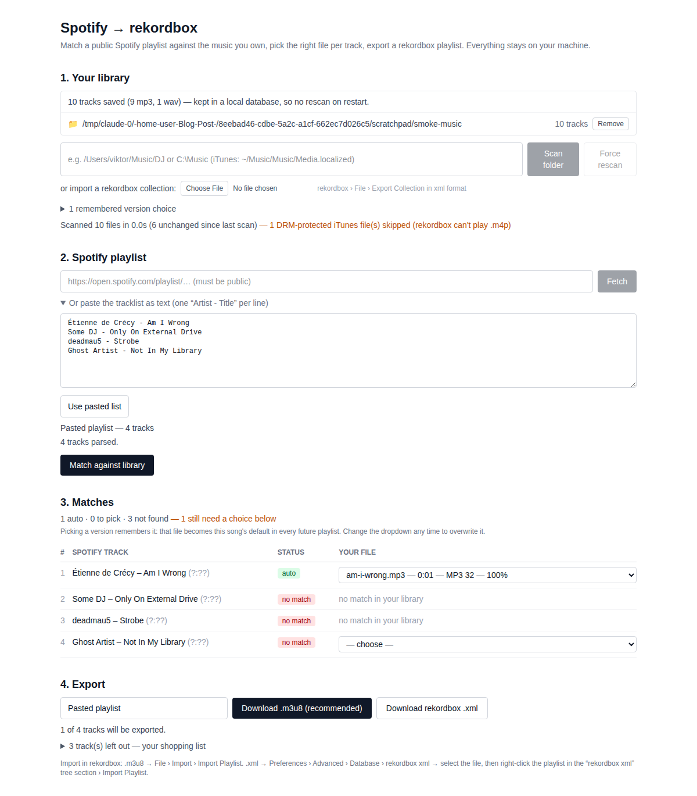

# Spotify → rekordbox

A small local webapp that turns a **public Spotify playlist** into a **rekordbox playlist built from music files you already own**:

1. Name a library (one per device) and load it — **scan a music folder**, **import a rekordbox XML export**, or both
2. Paste a Spotify playlist link (no Spotify account or API key needed)
3. It fuzzy-matches each Spotify track against your library; when several versions exist (original + remixes), **you pick one from a dropdown** — and it **remembers that pick** as the song's default for every future playlist
4. Download a `.m3u8` or rekordbox `.xml` playlist and import it into rekordbox — plus a `.txt` shopping list of everything the playlist wanted that you don't own

Your library is kept in a local SQLite file, so you scan once — not on every launch.

Everything runs on your machine. Nothing is uploaded anywhere.



## Prerequisites

- Python ≥ 3.11
- Node ≥ 20
- rekordbox (5/6/7) to import the result
- A **public** Spotify playlist URL (or any tracklist as text)

## Setup

```bash
# Python backend
python3 -m venv .venv
source .venv/bin/activate        # Windows: .venv\Scripts\activate
pip install -r requirements.txt

# Frontend
npm install
```

## Run

```bash
npm run dev        # dev mode → open http://localhost:5173
```

or, closer to "production":

```bash
npm run build
npm start          # → open http://127.0.0.1:8000
```

Both need the venv active (the server runs via `python -m uvicorn`). The server binds to `127.0.0.1` only — it can read your local folders, so never expose it on a network.

## Your libraries

Music is organised into **named libraries** — normally one per device ("MacBook", "Studio PC", "USB drive"). You name a library before putting anything in it, and the picker at the top of section 1 chooses which one a playlist is matched against.

Everything is stored in `data/library.db` (SQLite) and reloaded at startup, so **restarting the app never costs you a rescan**, and the library you had selected is still selected.

Libraries are fully independent: their tracks, their sources, and their remembered version choices. That last one matters — the same song resolves to a different file on each device, so a single shared list of choices would have your devices overwriting each other. Deleting a library removes its scanned data and choices; it never touches your music files.

Each library is built from one or more sources — a scanned folder, an imported rekordbox XML, or several of each, merged and deduplicated by file path:

**Scan a folder.** Reads tags (and filenames, for untagged files) from every audio file underneath, **including BPM and musical key when they are written into the file** — rekordbox and Serato store key in ID3 `TKEY`, Mixed In Key uses `TXXX:INITIALKEY`, and BPM lives in `TBPM` (MP4 `tmpo`, Vorbis `BPM` for m4a/FLAC). Nonsense values (`0`, unparseable, out of a 20–300 range) are ignored rather than stored. The first pass over a big folder takes a while; afterwards each file is re-read only when its size or modification time changed, so repeat scans take seconds. **Force rescan** ignores that and re-reads everything.

**Import a rekordbox XML export.** In rekordbox: `File › Export Collection in xml format`, then pick that file in the app. This is often the better source:

- it covers tracks on drives that aren't plugged in right now (you'll be told how many are currently missing — they still match, and rekordbox will find them once the drive is connected)
- it carries rekordbox's own analysed BPM and key, which beat whatever a tagger wrote into the file (and a later folder rescan will not take that back)
- it's near-instant, no matter how big the collection is
- rekordbox sometimes stores the version in a separate `Mix` field; that gets folded back into the title so the remix picker still works

Each loaded source is listed with its track count and can be removed independently.

## Most-played playlists

Upload rekordbox playlists — "Most played 2026", "Last month", "All time" — per library, and the app uses them to work out which version of a song you actually play. In rekordbox: right-click the playlist › Export. Any of **m3u8, m3u, pls, txt or xml** works; m3u8 is the most reliable because it carries file paths, while the TXT export has none and is resolved by artist and title instead (at a stricter threshold, since a wrong resolution here would quietly promote the wrong version later). Re-uploading a playlist of the same name replaces it.

They do two things:

**Ranking, always.** A file that's in one of your playlists is offered first and marked `★` in the picker, and being in several ranks higher still. This is deliberately a nudge, not a veto: it settles a close call between two versions but never outweighs a version or artist mismatch, so playing the radio edit constantly won't make it stand in for the original a playlist asked for. Where two candidates would otherwise be too close to call, membership is enough to settle it into an automatic pick.

**Filtering, on demand.** The dropdown next to *Match against library* can narrow matching to a single playlist — "which of this Spotify playlist do I have in my 2026 most-played" — with everything outside it reported as not found. A file that appears in several sources is stored once but claimed by each, so removing one source only drops the tracks nothing else claims — and a folder rescan never blanks the BPM and key that came from rekordbox, since a scan can't observe those.

## Usage notes

- **Files without tags** are matched by filename (`Artist - Title.mp3` patterns).
- **iTunes / Apple Music**: iTunes songs are `.m4a` files and fully supported (AAC and Apple Lossless). Typical folders: macOS `~/Music/Music/Media.localized/` (older: `~/Music/iTunes/iTunes Media/Music/`), Windows `C:\Users\<you>\Music\iTunes\iTunes Media\Music\`. **`.m4p` files** (pre-2010 iTunes purchases and Apple Music *subscription* downloads) are DRM-locked — rekordbox can't play them, so the scanner counts and reports them instead of matching them.
- **Playlists over ~100 tracks**: Spotify's public embed data stops around 100 tracks. The app warns you when this happens — paste the full tracklist as text instead (in Spotify select all tracks, or use any text list with one `Artist - Title` per line).
- **Matching**: green *auto* rows are confident matches (still overridable); amber *pick one* rows have several plausible files — that's the remix picker; *no match* rows list weak guesses if any. The dropdown shows each candidate's version (`[x remix]`, `[extended]`…), duration difference vs Spotify, format/bitrate, and score.
- **Remembered versions**: when you pick a version for a song, that file becomes the song's default in every future playlist — those rows come back pre-selected with a purple *remembered* chip. The dropdown still lists the alternatives, and choosing a different one overwrites the default. Section 1 lists everything you've taught it, with **Forget** per entry and **Forget all**.

  The choice is keyed on artist + core title + version, so it survives whichever way you load the playlist (Spotify link or pasted text), and different versions stay independent: teaching it your favourite *Strobe* says nothing about *Strobe (Radio Edit)*. Featured artists are ignored in that key, because playlists list them inconsistently. Choices also survive removing a library source — if the file comes back, so does the preference. They are **per library**, so each device learns its own.

## Importing into rekordbox

**M3U8 (recommended):** rekordbox → `File › Import › Import Playlist` → pick the downloaded `.m3u8`. Tracks already in your collection are matched by file path (cues/grids untouched); new files are added and analyzed.

**Missing tracks (.txt):** not for rekordbox — a shopping list of the playlist's tracks that aren't in the selected library. Plain `Artist - Title` lines so it pastes straight into a shop's search box (or back into this app's paste-a-tracklist box once you've bought them), with a couple of `#` comment lines for context. Tracks nothing matched are listed under *Not found*; ones that had a real match you passed on are listed separately under *Skipped*, so the buy-list stays honest.

**rekordbox XML:** `Preferences › Advanced › Database › rekordbox xml` → browse to the downloaded `.rekordbox.xml`. Show the xml pane via `Preferences › View › Layout › rekordbox xml`. In the tree's *rekordbox xml* section, right-click the playlist → `Import Playlist`.

## Checking the Spotify fetch

The playlist fetch uses Spotify's public embed page (the same trick "no sign-in" converter sites use) because Spotify's official API stopped allowing anonymous metadata access in 2026. Verify it works from your machine:

```bash
python scripts/probe_spotify.py "https://open.spotify.com/playlist/<id>"
```

`OK` + a track list means you're good. If Spotify changes their page format some day, the app tells you and the paste-text fallback always keeps working (plan B for developers: swap `server/spotify/` for the `spotifyscraper` PyPI package behind the same interface).

## Limitations (POC)

- Public playlists only (no Spotify login) — make a private playlist public for a minute, or paste it as text
- Embed data caps at ~100 tracks (warned in-app; text paste has no cap)
- Matching is metadata-only (tags/filenames/duration) — no audio fingerprinting
- The app reads your rekordbox collection but never writes to it; playlists come back as files you import

## Troubleshooting

- **Folder not found**: quotes and trailing slashes are trimmed automatically; check the path and permissions. `~` works.
- **Wrong matches after retagging**: hit **Force rescan**, or re-import a fresh XML export.
- **Library looks stale**: re-import the XML (same filename replaces the old import) or rescan the folder.
- **Accents look wrong after M3U8 import on Windows**: tell me — adding a UTF-8 BOM to the export is a one-line change.
- **Reset everything**: delete the `data/` folder.

## Development

```bash
.venv/bin/pytest           # 212 tests: parsers, scanner, database, libraries, playlists, matcher calibration, preferences, exports, API
npm run typecheck          # strict TS on the client
node scripts/screenshot.mjs <music-folder>   # regenerate docs/screenshot.png (app must be running)
```

The matching thresholds live in `server/matcher/score.py`; `tests/test_matcher.py` is the calibration harness — tune, run, repeat.
