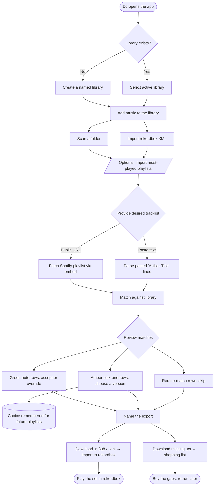
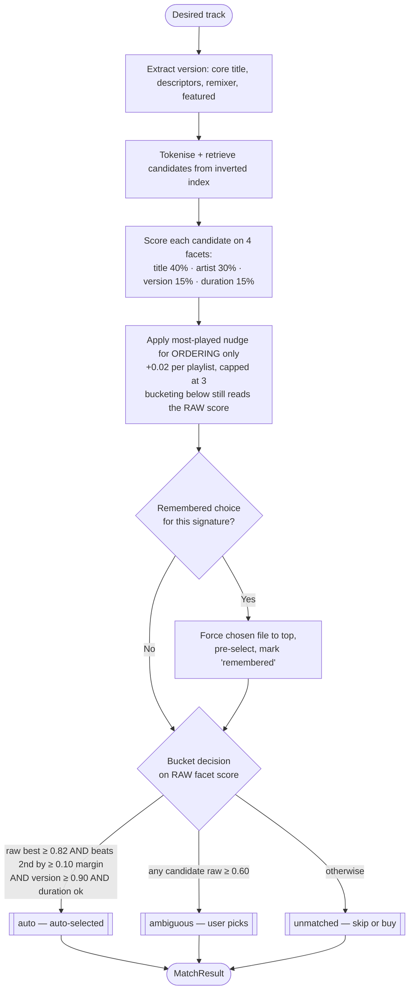
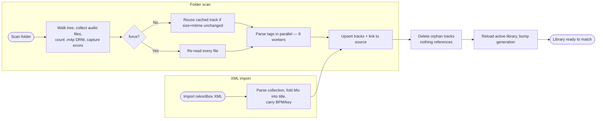
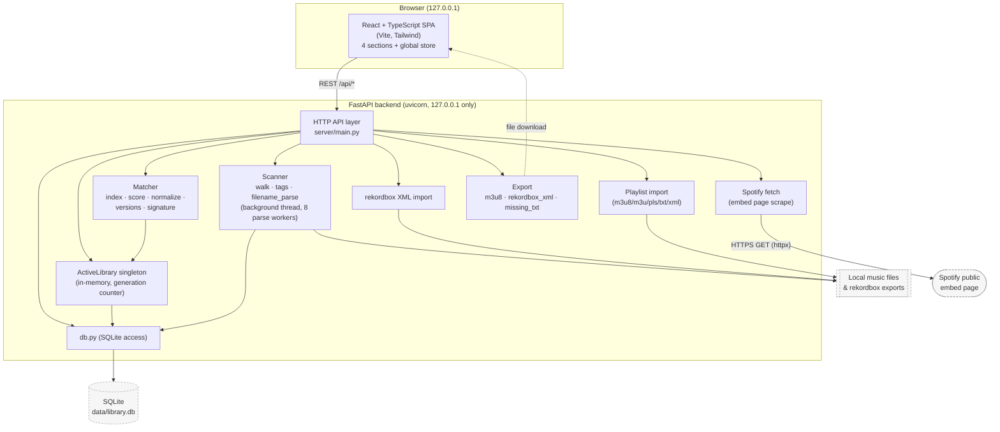
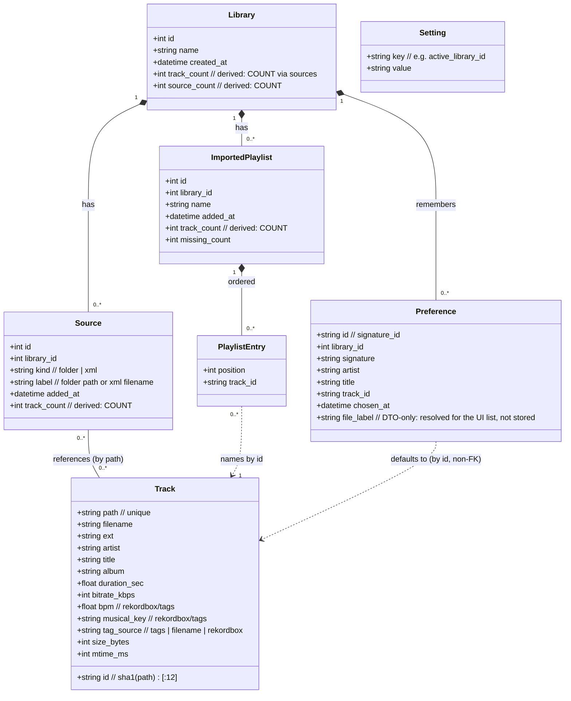
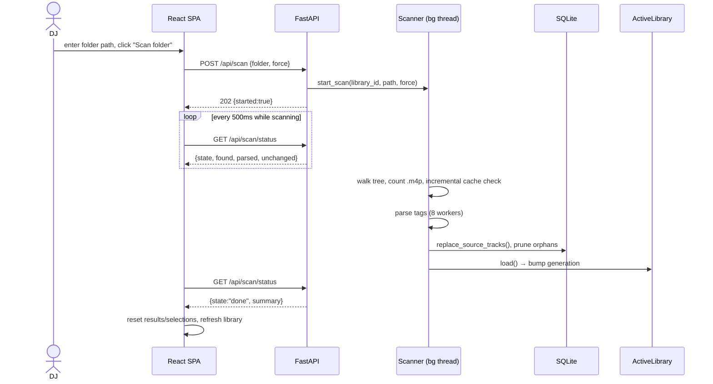
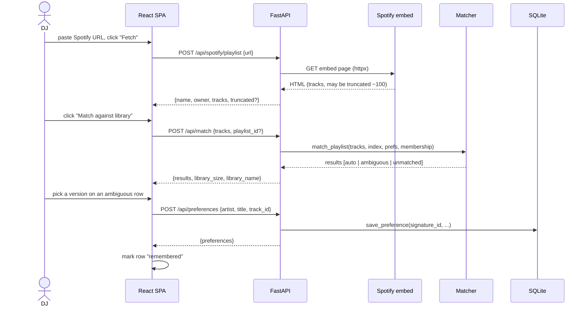

# Spotify → rekordbox — Technical & Product Analysis

> **Purpose of this document.** It captures *what the current proof-of-concept (POC) actually is and does*, in enough
> depth that it can be handed to a design partner (e.g. Claude Design) to produce wireframes, visual designs and a
> product spec for a proper, productionised application. It documents the domain, the business flows, the data model
> and the current UI as-built — plus the constraints and gaps that a redesign should address. It is primarily a
> **technical & product** analysis; the go-to-market/business dimension is scoped in §15 (currently a stub to fill in).
>
> **Status:** the POC works end-to-end. The intent is to keep this domain logic as the foundation and build a proper
> application around it.
>
> | Field | Value |
> |---|---|
> | **Version** | 0.1 (draft) |
> | **Last updated** | 2026-08-15 |
> | **Owner** | Project maintainer (Vikteur) |
> | **Scope** | Current POC as-built; forward-looking notes flagged inline |
>
> **Diagrams** are written in [Mermaid](https://mermaid.js.org/) so they render in GitHub, VS Code, Notion, Obsidian and
> most doc tools, and can be edited without a diagramming license.

---

## 1. Executive summary

**Spotify → rekordbox** is a local, single-user web application that lets a DJ turn a **public Spotify playlist** (or any
pasted tracklist) into a **rekordbox playlist built from the music files they already own** — without a Spotify account,
API key, or uploading *your library, choices or files* anywhere.

The hard problem it solves is **matching**: a Spotify track ("Substitution — Purple Disco Machine Remix", 3:24) has to be
resolved to the *right* local file, out of a library where the same song may exist as the original, several remixes, a
radio edit and an extended mix. The app fuzzy-matches on title, artist, version and duration; auto-selects when it is
confident; asks the user to pick when it is not; and **remembers each pick** so the choice is reused on every future
playlist.

**Current value proposition**

| For a DJ who… | The app…|
|---|---|
| Curates sets from Spotify but performs from rekordbox | Bridges the two without manual searching per track |
| Owns a large, messy, multi-device library | Indexes it once (SQLite), matches against it in seconds |
| Has multiple versions of the same song | Surfaces the alternatives and learns the preferred one |
| Wants to know what to buy | Produces a "shopping list" of what the playlist wanted but they don't own |

**Everything runs on `127.0.0.1`.** The app reads local folders and the rekordbox collection, never writes to
rekordbox, and never uploads your library, your remembered choices or your files. This privacy-by-architecture is a
core product property, not an implementation detail.

**The one outbound call.** To resolve a Spotify playlist URL the backend makes a single outbound **HTTPS GET to
Spotify's public embed page** (see §7 and §10.2), carrying the playlist URL from the user's IP. So Spotify can observe
*which public playlists are fetched and when* — no account, library, or choice data is sent, but this is a genuine
external request and the "entirely local" framing is scoped to your own data, not to zero network egress. The
paste-text ingestion path makes no network call at all.

---

## 2. Problem statement & product vision

### 2.1 The problem
- DJs discover and curate music on **Spotify** (streaming, social, playlists) but *perform* from **rekordbox** using
  **files they own**. Owned files are required for reliable offline performance and are independent of subscription
  state, network quality or a provider pulling a track. (rekordbox does now support streaming integrations — TIDAL,
  Beatport, SoundCloud, Apple Music — with analysis/beatgrids, so the point is *ownership and offline reliability for
  gigs*, not that streaming can't be beat-matched at all. Spotify specifically is not a rekordbox streaming source.)
- Rebuilding a Spotify playlist by hand in rekordbox means searching the collection track-by-track and repeatedly
  choosing between near-identical versions — slow, error-prone, and forgotten by the next playlist.
- Spotify's official API stopped allowing anonymous metadata access in 2026, so "just call the API" is not available.

### 2.2 The vision
A tool that treats the DJ's **owned library as the source of truth**, ingests a *desired* tracklist from anywhere,
and produces a rekordbox-ready playlist plus a buy-list for the gaps — getting smarter about version preferences the
more it is used, and staying entirely local and private.

### 2.3 What "proper application" implies (beyond POC)
The POC proves the domain logic. Productionising implies: a designed, resilient UI; multi-user or at least multi-profile
robustness; packaged distribution (not "run two dev servers"); better ingestion (Spotify >100 tracks, other sources);
and hardening of the matching/ingestion edge cases. See §11.

---

## 3. Stakeholders & personas

| Persona | Description | Goals | Pain points the app addresses |
|---|---|---|---|
| **The DJ (primary user)** | Owns a local music library, performs from rekordbox, curates on Spotify | Fast, accurate playlist conversion; right version every time; know what to buy | Manual per-track search; version confusion; repeated choices |
| **Multi-device DJ** | Same person, several machines/drives ("MacBook", "Studio PC", "USB") | Each device matches against its own files and remembers its own choices | One shared choice-list would have devices overwriting each other |

> **Multi-device — how it actually works today.** The app is a *single local instance* reading the local filesystem with
> a local SQLite and **no sync**. "One library per device" therefore has two possible realisations, and the intended one
> should be stated:
> - **(a) One app instance per machine** — each machine keeps its own libraries and preferences; nothing is shared
>   across machines. This matches the architecture but means a laptop can't see the desktop's remembered choices.
> - **(b) One instance + XML imports** — a single instance holds a library named e.g. "Studio PC" populated by **XML
>   import** (files not locally present, since folder-scan can only reach locally-mounted files). This works for matching,
>   but the exported `.m3u8` is **path-based** (§4.6): its paths point at the *other* device's filesystem, so the export
>   is only portable if those paths resolve on the target machine.
>
> **Intended model: (a)** — one instance per device, no cross-machine sync — with (b) available as an advanced
> "match against a disconnected drive" case whose path-portability caveat the UI should surface at export time.
| **The developer/maintainer** | Builds and tunes the tool | Tune match thresholds; swap the Spotify fetch if the page format changes | Fragile scraping; calibration (no runtime config surface today — see note) |
| **(Future) less-technical DJ** | Not comfortable running dev servers | A packaged app they can install and open | Current setup requires Python + Node |

> There is **no server-side multi-tenant user**: today the "user" is whoever is at the machine. Multi-user is a
> productionisation question, not a current feature.

---

## 4. Current capability inventory (as-built)

### 4.1 Libraries
- Named **libraries**, normally one per device. One is *active* at a time; the active id is persisted so a restart keeps
  the same selection.
- CRUD: create, rename, select, delete. Deleting a library removes its scanned data, sources, playlists and choices —
  **never touches music files**.

### 4.2 Sources (how a library is filled)
- **Folder scan** — recursively reads audio files (`mp3, m4a, flac, wav, aiff/aif`), reads tags (artist/title/album/
  duration/bitrate) and, when present, **BPM and musical key** written into the file. Incremental: a repeat scan only
  re-reads files whose size or mtime changed; **Force rescan** re-reads everything. `.m4p` (DRM) files are counted and
  reported, not matched.
- **rekordbox XML import** — imports a `File › Export Collection in xml format`. Carries rekordbox's own analysed BPM/key
  (which beat tagger values and survive a later folder rescan), covers files on drives not currently connected, and is
  near-instant.
- Multiple sources per library, **merged and deduplicated by file path**. Each source is listed with its track count and
  can be removed independently; removing one source only drops tracks nothing else claims.

### 4.3 Most-played playlists (ranking signal)
- Import rekordbox playlist exports (`m3u8, m3u, pls, txt, xml`) per library ("Most played 2026", "Last month"…).
- **Ranking nudge**: a file in a playlist is offered first and marked ★; being in several ranks higher. Deliberately a
  tie-breaker, never a veto over version/artist mismatch. **The bonus affects candidate ordering only — bucketing
  (auto / ambiguous / unmatched) reads the raw facet score, not the bonused score** — so being on a most-played playlist
  can move a file to the top of the list but cannot by itself push a candidate across the auto/ambiguous threshold.
- **Filtering on demand**: narrow matching to a single imported playlist ("which of this Spotify playlist do I have in my
  2026 most-played").
- Playlists can be folded open to see their exact contents in export order, with duration/BPM/key.

### 4.4 Ingesting the desired tracklist
- **Spotify public playlist URL** → fetched via Spotify's public *embed* page (no login/API key). Warns when the embed
  caps at ~100 tracks.
- **Paste-text fallback** — one `Artist - Title` per line; lenient parsing (strips numbering, accepts `-`/`–`/`—`/tab).
  Always works and has no track cap.

> **Known gap — the fallback doesn't actually solve truncation.** The embed caps at ~100 tracks, and paste-text has no
> cap, but the doc never says **how a user obtains a 200-track list as text** when the embed itself truncates. The
> intended source today is *outside the app* — e.g. copy the tracklist from the Spotify desktop/web client (select all →
> copy), or an export tool the user already has — then paste it. So paste-text is a workaround only if the user has an
> independent way to get the full list; it is **not** a way to recover the tracks the embed dropped. Productionising
> should either ingest large playlists directly (see §14) or give explicit in-app guidance on obtaining the full text.

### 4.5 Matching & choosing
- Fuzzy match each desired track to library candidates; classify each into **auto** (confident), **ambiguous**
  (pick one), or **unmatched**.
- A rich **version picker** dropdown per track shows each candidate's version tag, duration delta vs Spotify, BPM/key,
  format/bitrate, match score and ★ playlist membership.
- **Remembered choices**: picking a version stores it as the song's default for **every future playlist in that library**;
  those rows come back pre-selected with a "remembered" chip. Keyed on artist + core title + version (featured artists
  ignored), so it survives whichever way the playlist was loaded and keeps different versions independent. Per-library.
  Individual **Forget** and **Forget all**.

### 4.6 Export
- **`.m3u8`** (recommended) — path-based, rekordbox matches existing tracks and adds new ones.
- **rekordbox `.xml`** — importable via the rekordbox xml pane.
- **Missing `.txt`** — a shopping list of what the playlist wanted but the library lacks, split into *Not found* vs
  *Skipped* (had a real match you passed on), so the buy-list stays honest.

---

## 5. Domain glossary

| Term | Meaning |
|---|---|
| **Library** | A named collection of tracks, typically one per device. The unit of isolation for tracks, sources, playlists and preferences. |
| **Source** | One origin feeding a library: a scanned **folder** or an imported rekordbox **xml**. |
| **Track** | A single audio file, identified globally by `sha1(path)[:12]`. Shared across sources/libraries that reference the same path. |
| **(Imported) Playlist** | A rekordbox playlist export used as a *ranking/filter signal* (e.g. "Most played 2026"). Not the thing being exported. |
| **Desired track / playlist input** | A track from the Spotify playlist (or pasted list) the user wants to reproduce. |
| **Candidate** | A library track proposed as a match for a desired track, with a score and facet breakdown. |
| **Bucket** | The confidence class of a match: `auto`, `ambiguous`, `unmatched`. |
| **Version / descriptors** | The variant of a song: remix, extended, radio edit, club mix, etc., plus the remixer. |
| **Signature** | A stable identity for a song (`artist | core-title | descriptors | remixer`, featured artists excluded) used to key remembered choices. |
| **Preference / remembered choice** | A stored "for this signature, use this file" default, per library. |

> The domain glossary above is conceptual. Two terms that appear in the diagrams — **Generation** (cache-invalidation
> counter) and the **ActiveLibrary singleton** (in-memory current-library holder) — are **caching/implementation
> mechanics, not domain concepts**; they are documented in **Appendix C — Implementation notes (§18)** so the domain
> model stays conceptual. A redesign is free to replace both without changing the domain.

---

## 6. Business flows

### 6.1 End-to-end happy path (business flow)



### 6.2 Matching decision flow (business rules)



### 6.3 Library ingestion flow (scan vs import)



---

## 7. System architecture (UML component / deployment)

The app is a local two-tier system: a **React SPA** talking over HTTP to a **FastAPI** backend that owns a **SQLite**
file and reads the local filesystem and Spotify's public embed page.



**Tech stack**

| Layer | Technology |
|---|---|
| Frontend | React 18, TypeScript (strict), Vite 7, Tailwind CSS 4 |
| Backend | Python ≥3.11, FastAPI, uvicorn |
| Matching | rapidfuzz (fuzzy string scoring) |
| Tag reading | mutagen |
| Spotify fetch | httpx against the public embed page |
| Storage | SQLite (single file, WAL mode), schema v5 |
| Packaging today | Two dev servers (`npm run dev`) or built SPA served by uvicorn (`npm start`) |

---

## 8. Domain model (UML class diagram)

This is the conceptual/domain model as reflected by the API models and persistence. Multiplicities reflect the real
relationships (a track is shared across sources by path).



**Notes for a designer/architect**
- **Entities vs. DTOs.** This diagram intentionally overlays two things; the inline `// derived` and `// DTO-only`
  comments mark the difference. Fields tagged **derived** (`track_count`, `source_count`) are **not stored columns** —
  they are `COUNT(...)` aggregates computed for API responses (see the physical schema in §9, which has no such columns).
  Fields tagged **DTO-only** (`Preference.file_label`) exist **only in the API response shape**, resolved at read time
  for the UI list. Everything untagged is a persisted column. A productionised codebase should split these into a persistence
  model and an API DTO rather than one conflated class.
- **A track is not owned by a library.** It is global (keyed by absolute path) and *referenced* by sources via a join.
  A library "contains" a track if any of its sources reference it. This is what makes dedup-by-path and independent
  source removal work.
- **Preferences and playlist entries point at tracks by id but are *not* foreign-keyed**, so a preference survives the
  file leaving the library and returns intact if the file comes back.

---

## 9. Data model (ER diagram)

Physical SQLite schema (v5). `track_sources` and `playlist_tracks` are join tables.

```mermaid
erDiagram
    LIBRARIES ||--o{ SOURCES : has
    LIBRARIES ||--o{ PLAYLISTS : has
    LIBRARIES ||--o{ PREFERENCES : has
    SOURCES ||--o{ TRACK_SOURCES : links
    TRACKS ||--o{ TRACK_SOURCES : linked
    PLAYLISTS ||--o{ PLAYLIST_TRACKS : contains
    TRACKS ||..o{ PLAYLIST_TRACKS : "named_in (logical, non-FK)"
    TRACKS ||..o{ PREFERENCES : "defaults_to (logical, non-FK)"

    LIBRARIES {
        int id PK
        text name UK
        text created_at
    }
    SOURCES {
        int id PK
        int library_id FK
        text kind "folder | xml"
        text label "path or filename"
        text added_at
    }
    TRACKS {
        text id PK "sha1(path)[:12]"
        text path UK
        text filename
        text ext
        text artist
        text title
        text album
        real duration_sec
        int bitrate_kbps
        real bpm
        text musical_key
        text tag_source
        int size_bytes
        int mtime_ms
    }
    TRACK_SOURCES {
        text track_id PK-FK
        int source_id PK-FK
    }
    PLAYLISTS {
        int id PK
        int library_id FK
        text name
        text added_at
        int missing_count
    }
    PLAYLIST_TRACKS {
        int playlist_id PK-FK
        text track_id PK
        int position
    }
    PREFERENCES {
        int library_id PK-FK
        text id PK "signature_id"
        text signature
        text artist
        text title
        text track_id "non-FK"
        text chosen_at
    }
    SETTINGS {
        text key PK
        text value
    }
```

**Integrity & lifecycle rules**
- `ON DELETE CASCADE` from `libraries` → sources → track_sources; deleting a library also drops its playlists and
  preferences. Deleting a source deletes its `track_sources` rows; tracks with no remaining sources are pruned.
- `UNIQUE(library_id, kind, label)` on sources → scanning the same folder twice updates one source, not two.
- `UNIQUE(library_id, name)` on playlists → re-importing a same-named playlist replaces it.
- `tracks.path` is `UNIQUE` → the true dedup key; the `sha1` id is a convenience/stability handle.
- `SETTINGS` currently stores only `active_library_id`.
- **Dashed relationships are logical, not foreign-keyed.** `PLAYLIST_TRACKS.track_id` and `PREFERENCES.track_id`
  reference a track *by id* but carry **no `FOREIGN KEY` constraint** — there is no enforced referential integrity or
  cascade on them (shown dashed above). This is deliberate: a preference or playlist entry survives its track leaving the
  library and re-binds if the file returns (§8). Only the solid relationships (`libraries → sources → track_sources`,
  `libraries → playlists/preferences`) are true FKs with `ON DELETE CASCADE`.

---

## 10. Key runtime sequences (UML sequence diagrams)

### 10.1 Scan a folder (async with progress polling)



### 10.2 Fetch → Match → Choose → Remember



### 10.3 Export to rekordbox

```mermaid
sequenceDiagram
    actor DJ
    participant UI as React SPA
    participant API as FastAPI
    participant EXP as Export builders

    DJ->>UI: name the playlist, click "Download .m3u8"
    UI->>API: POST /api/export {name, format, track_ids}
    API->>EXP: build_m3u8 / build_rekordbox_xml
    EXP-->>API: file content (utf-8)
    API-->>UI: attachment (blob)
    UI->>UI: trigger browser download
    DJ->>UI: click "Download missing .txt"
    UI->>API: POST /api/export/missing {name, tracks}
    API->>EXP: build_missing_txt (Not found / Skipped)
    EXP-->>API: text content
    API-->>UI: attachment (blob)
    Note over DJ: Import .m3u8/.xml into rekordbox;<br/>use .txt as a buy-list
```

---

## 11. Matching engine reference (business rules a redesign must preserve)

The matching engine is the product's core IP. A redesign of the UI must keep exposing these concepts; a redesign of the
logic must respect this calibration. All thresholds live in `server/matcher/score.py` (index constants in
`server/matcher/index.py`).

**Facets and weights** (weighted mean, re-normalised when a facet is unknown):

| Facet | Weight | How |
|---|---|---|
| Title | 40% | `fuzz.token_sort_ratio` (order-insensitive, length-sensitive) |
| Artist | 30% | `fuzz.token_set_ratio` (extra artists don't penalise) |
| Version | 15% | custom `version_score` comparing descriptors/remixer |
| Duration | 15% | 1.0 within 3s of the target, then linear decay reaching 0.0 at ~45s difference; unknown → facet dropped |
| *(filename-only files)* | Combined 70% | single facet when no artist tag |

**Bucketing thresholds**

| Constant | Value | Meaning |
|---|---|---|
| `REPORT_THRESHOLD` | 0.45 | below this, a candidate isn't shown |
| `STRONG_THRESHOLD` | 0.60 | at/above → at least "ambiguous" |
| `AUTO_SCORE` | 0.82 | minimum to consider auto-selecting |
| `AUTO_MARGIN` | 0.10 | best must beat 2nd by this |
| `AUTO_MIN_VERSION` | 0.90 | version must match to auto-pick (blocks a remix standing in for the original) |
| `AUTO_MIN_DURATION` | 0.55 | with the decay above (1.0 ≤3s, 0.0 at ~45s), a 0.55 facet score ≈ **±22s** duration tolerance; waived when version is a perfect 1.0 |
| `MAX_CANDIDATES` | 8 | candidates returned per track |
| `PLAYLIST_BONUS` / cap | 0.02 / 3 | most-played nudge |

> **Tuning has no runtime surface today (productionisation item).** These thresholds are **module-level constants in
> `server/matcher/score.py`** (and `index.py`). "The developer tunes thresholds" (§3) therefore means *editing source and
> redeploying* — there is no config file, environment override, admin UI, or per-library calibration. Productionising
> should add a config surface (at minimum a settings file/env; ideally per-library overrides) so tuning doesn't require a
> code change. Until then, treat the values above as build-time constants, not user/operator settings.

**Normalization** folds accents/Unicode to ASCII, expands `&`→`and`, drops apostrophes, so macOS decomposed filenames
equal NFC tags. **Version detection** extracts `core_title`, `descriptors` (canonicalised: "radio edit"→radio, "original
mix"→erased), `remixer`, and `featured` (excluded from the signature because playlists list them inconsistently).
**Signature** = `normalize(artist) | core_title | sorted(descriptors) | remixer` → SHA1[:16] is the preference key.

### 11.1 Matching accuracy — evaluation methodology (metrics TBD)

Matching is called "the product's core IP," so the single most important number for a handoff is *how often auto is
right*. The POC has **not yet been measured against a labelled golden set** — the figures below are the metrics to
populate, not current results.

**Proposed evaluation method**
1. **Golden set.** Assemble ≥200 desired-track → correct-file pairs across the hard cases the matcher exists for:
   multiple remixes/edits of one song, radio vs extended, featured-artist variance, accented/decomposed filenames,
   filename-only (untagged) files, and genuine no-match rows. Label each with the *human-correct* outcome
   (specific file, or "not in library").
2. **Run** the current matcher over the set and compare bucket + selected file to the labels.
3. **Report** the metrics below and re-run on every calibration change (wire into `tests/test_matcher.py`, which already
   holds calibration cases).

**Metrics to report** (fill in once measured):

| Metric | Definition | Target | Current |
|---|---|---|---|
| Auto precision | of rows auto-selected, % where the auto-picked file is correct | ≥ 0.98 (false auto is the worst failure) | TBD |
| Auto coverage | % of resolvable rows the matcher auto-selects (vs sending to "pick one") | as high as precision allows | TBD |
| Wrong-version auto rate | auto-picks that chose the wrong variant (remix ↔ original) | ≈ 0 | TBD |
| Ambiguous recall | of rows that *have* a correct file, % where it appears in the candidate list | ≥ 0.99 | TBD |
| False no-match rate | rows marked "unmatched" that actually had a correct file | low | TBD |
| Preference reuse correctness | remembered choice re-applied to the right future rows | ≈ 1.0 | TBD |

Until these exist, "auto is confident" is a design assertion, not a measured claim; the redesign's confidence UI (§13.5)
should not over-promise beyond what evaluation supports.

---

## 12. Current UI as-built (for redesign handoff)

The SPA is a **linear 4-step wizard**, top to bottom, in a centered `max-w-5xl` column, minimal Tailwind styling. Each
step depends on the previous (can't match without a library; can't export without matches). State is centralised in one
store (`store.tsx`) and shared via context.

```mermaid
flowchart TD
    H["Header: 'Spotify → rekordbox' + tagline"]
    H --> S1
    subgraph S1["① Your libraries"]
        s1a[Library picker + create/rename/delete]
        s1b[Folder path input → Scan folder / Force rescan<br/>live progress line]
        s1c[Import rekordbox XML → count + missing note]
        s1d[Sources list — each removable, with icon + count]
        s1e[Most-played playlists — import, fold open, remove]
        s1f[Remembered choices — collapsible, Forget / Forget all]
    end
    S1 --> S2
    subgraph S2["② Spotify playlist"]
        s2a[Spotify URL input → Fetch]
        s2b[Collapsible: paste tracklist as text → Use pasted list]
        s2c[Loaded playlist summary: name, owner, count]
        s2d[Truncation warning ~100 tracks]
        s2e[Optional: limit matching to one imported playlist]
    end
    S2 --> S3
    subgraph S3["③ Matches"]
        s3a[Match against library button]
        s3b[Summary line: N auto · N to pick · N not found]
        s3c[Per-row: number · Spotify info · status chip ·<br/>version picker dropdown]
        s3d[Dropdown option: file · version · Δduration ·<br/>BPM·key · format/bitrate · score% · ★]
    end
    S3 --> S4
    subgraph S4["④ Export"]
        s4a[Playlist name input]
        s4b[Download .m3u8 / rekordbox .xml / missing .txt]
        s4c[N of M will be exported]
        s4d[Collapsible shopping list]
        s4e[Footer: how to import into rekordbox]
    end
```



**Status chip colour language** (worth preserving semantically, restyling visually):

| Chip | Colour today | Meaning |
|---|---|---|
| auto | green | confident auto-selected match |
| remembered | purple | selection is a saved preference |
| manual | blue | user picked a non-auto candidate |
| pick one | amber | ambiguous, awaiting a choice |
| skipped | gray | user chose "skip this track" |
| no match | red | nothing plausible in the library |

**The 6 chips are UI states layered over the 3 matcher buckets** (§5 / §6.2). The bucket is what the matcher computes;
the chip additionally reflects *how the current selection came to be*. Mapping:

| Matcher bucket | Possible chips | Notes |
|---|---|---|
| `auto` | **auto**, or **remembered** | `remembered` overrides the `auto` label when the pre-selected file came from a saved preference rather than the confidence rule; a remembered row is still bucketed `auto`. |
| `ambiguous` | **pick one** (default), **manual** (once the user picks a candidate), **remembered** (a preference pre-selected one), or **skipped** (user chose to skip) | The chip tracks the user's action on the row; the bucket stays `ambiguous`. |
| `unmatched` | **no match**, or **skipped** | `skipped` here means the user acknowledged there's no usable match. |

**Notable UX behaviours to carry forward**
- Scan progress polled every 500ms; live "found/parsed/unchanged" line.
- Warnings inline: Spotify truncation, `.m4p` DRM count, XML "files not on this machine", "N still need a choice".
- Progressive disclosure via collapsibles: paste-text, imported playlist contents (lazy-loaded), remembered choices,
  shopping list.
- The dropdown is doing a *lot* of work (version, deltas, BPM/key, format, score, ★) in a single `<select>` label —
  a prime redesign target (see §13).
- Downloads are real file attachments, not navigation.
- Last-used folder persisted to `localStorage`; everything else server-persisted and restored on mount.

---

## 13. Design opportunities & recommendations (for Claude Design)

These are UX/product opportunities surfaced by the analysis — **suggestions for the redesign, not current features.**

1. **Rework the version picker.** Today all candidate metadata is crammed into a `<select>` option string. A designed
   component (cards/rows with columns for version, Δduration, BPM/key, format, score, ★, waveform-less but structured)
   would make the core decision far clearer, and enable **bulk actions** ("accept all auto", "skip all no-match").
2. **Elevate the three buckets** into a scannable review surface (tabs or grouped sections: *Ready* / *Needs a choice* /
   *Not found*), with counts and a progress meter toward "every row resolved".
3. **Wizard vs. workspace.** The linear 4-step flow is good for first use; power users re-run constantly. Consider a
   persistent left rail (library + status) with the matching table as the main workspace.
4. **Library setup as onboarding.** First-run: guide "name a device → scan or import → optionally add most-played".
   Make the folder-path text box friendlier (native folder picker, recent folders, drag-and-drop).
5. **Match confidence, visualised.** Scores and facet breakdowns exist in the API (`parts`) but aren't shown well; a
   compact confidence indicator per row would build trust in "auto".
6. **Empty/'>100 tracks' and error states** deserve first-class designed states, not inline red text.
7. **Remembered choices as a manageable library**, not just a collapsible list — searchable, with the file each maps to.
8. **Packaging.** Productionising should target a one-click desktop app (e.g. Tauri/Electron wrapping the SPA + bundled
   Python, or a rewritten native backend) so non-technical DJs aren't running two dev servers.

**Constraints a design must respect**
- **Local & private**: no cloud accounts, no uploads implied by the UI. Any "sync"/multi-device feature must be designed
  around this or explicitly change the privacy model.
- **Per-device libraries and per-library preferences** are a deliberate model, not an accident — a single global choice
  list would corrupt cross-device matching.
- The **rankings-nudge-not-veto** principle should be legible in the UI (★ helps but never forces a wrong version).

---

## 14. Known limitations & risks (current POC)

| Area | Limitation / risk | Productionisation implication |
|---|---|---|
| Spotify ingestion | Public playlists only; embed caps ~100 tracks; scraping breaks if Spotify changes the page | Add larger-source ingestion; keep paste-text as guaranteed fallback; abstract the fetcher (already isolated in `server/spotify/`) |
| **Spotify — legal/ToS** | Scraping the embed page may violate **Spotify's Terms of Service** (automated access/scraping of Spotify properties). Low-stakes for a personal POC, but a real business risk for a **distributed, productionised** app — potential access blocking or a takedown/cease-and-desist | Get legal review before distribution; prefer an official/licensed data path or user-supplied lists; treat the scraper as a stopgap, not a shippable dependency |
| Matching | Metadata-only (tags/filenames/duration); no audio fingerprinting | Fingerprinting could raise confidence but is a major addition |
| Matching — accuracy | No measured precision/recall for auto-selection (see §11.1); "auto is confident" is unvalidated | Stand up the golden-set evaluation in §11.1 and publish the numbers before promising accuracy |
| **Security / hardening** | The app runs an **unauthenticated HTTP server on localhost** and: accepts a **user-supplied folder path** (arbitrary local-FS read scope / traversal beyond intended roots); ingests **raw rekordbox XML** (XML parser → **XXE / entity-expansion** exposure) and raw playlist bodies; fetches a **user-supplied URL** (**SSRF** surface — could be pointed at internal/link-local addresses). Localhost-only is *not* a security boundary: other local processes can reach it, and a malicious web page can hit it via **DNS-rebinding / CSRF** since there's no auth or origin check | Add: origin/host allow-list + CSRF token or auth; a hardened XML parser (entities/DTDs disabled); path canonicalisation confined to allowed roots; URL allow-listing (scheme/host) + block private ranges for the fetcher; bind explicitly to `127.0.0.1`. Do a security review before any non-loopback exposure |
| Concurrency | Single-writer assumption; `/api/match` refused during scan; in-memory index guarded only by that assumption | Needs real locking/snapshotting for any multi-user or concurrent scenario |
| **Performance / scale (unquantified)** | Claims like "matches in seconds" (§1) and "8 parse workers" (§10.1) have **no stated scale envelope** — no numbers for library size, scan throughput (files/sec), match latency at N tracks, or memory of the in-memory index | Establish and document bounds (target: e.g. tens of thousands of tracks; scan & match latency at 10k/50k/100k) — designers and packagers need them. **Currently TBD** |
| rekordbox | App reads the collection but **never writes**; results come back as importable files | By design; a two-way sync would be a large scope/scope-risk change |
| Distribution | Requires Python + Node and two dev servers (or a manual build) | Package as an installable app |
| Multi-user | No server-side user model; "user" = whoever is at the machine | Decide single-user-local vs multi-profile vs multi-tenant before scaling |
| Data safety | Single SQLite file; "reset = delete `data/`" | Backups, migration story, export/import of the whole config |

---

## 15. Business & market context

> **Why this section exists.** Despite the original title, §1–§14 are ~90% technical/product spec. A genuine business
> analysis needs the dimensions below. They are **scoped but not yet researched** — this is the frame to fill in, and the
> reason the document is retitled *Technical & Product Analysis* until it is.

### 15.1 Competitive landscape (to research)
Existing tools that overlap the "get owned files into rekordbox / bridge streaming and a DJ library" space — a scan
should position this app against each on *local-first*, *version-aware matching*, *preference learning*, and *price*:

| Tool / approach | Overlap | How this app differs (hypothesis — verify) |
|---|---|---|
| **Lexicon DJ** | Library manager across DJ apps; playlist sync; smart playlists | Paid, cloud-adjacent, broad library manager; this app is narrow (Spotify→owned files), local-only, version-preference learning |
| **Rekord Buddy / MIXO / rekordcloud-style utilities** | Cross-app/library conversion, tag/collection migration | Different job (collection migration vs desired-tracklist → owned-file matching) |
| **rekordbox native streaming (TIDAL/Beatport/etc.)** | Play streamed tracks in rekordbox | Requires subscription + online; doesn't build from *owned* files; Spotify isn't a source |
| **Manual search in rekordbox** | The status quo this replaces | Slow, per-track, forgets choices — the core pain (§2) |
| **DIY scripts / Spotify-export sites** | Extract a Spotify tracklist to text | Only produce a list; no library matching, no version disambiguation, no export |

*(All rows are to be confirmed — feature parity, pricing and status change frequently.)*

### 15.2 Market sizing (TBD)
- **Who:** DJs who both curate on Spotify and perform from an owned rekordbox library. Sub-segment of the rekordbox user
  base; size **TBD** (approach: rekordbox install base × share who own files × share who curate on Spotify).
- **Reachable:** communities where this pain is voiced (DJ forums, subreddits, Discords) — **TBD**.

### 15.3 Monetization & pricing (open question)
Options to evaluate: free/OSS; one-time paid desktop app; freemium (free matching, paid packaging/extras);
donation/support. Constraint: the **local-first, no-account** privacy model (§13) rules out usage-metered SaaS pricing
unless the model changes. **No decision yet.**

### 15.4 Success metrics / KPIs (to define)
Candidate product KPIs once shipped: activation (library scanned + first playlist matched), auto-selection acceptance
rate, time-to-first-export, preference reuse rate, repeat-use frequency, shopping-list conversion. Tie the accuracy
metrics in §11.1 to these.

### 15.5 Go-to-market (TBD)
Distribution channel (§13.8 one-click app), positioning ("your files, the right version, remembered"), and the ToS/legal
review from §14 all gate any public launch.

---

## 16. Appendix A — REST API surface (current)

| Method & path | Purpose |
|---|---|
| `GET /api/health` | Liveness |
| `GET /api/library` | Active library summary |
| `POST /api/libraries` | Create library (becomes active) |
| `POST /api/libraries/{id}/select` | Switch active library |
| `PATCH /api/libraries/{id}` | Rename |
| `DELETE /api/libraries/{id}` | Delete library (and its data) |
| `DELETE /api/library/sources/{id}` | Remove a source |
| `POST /api/library/xml` | Import rekordbox collection XML (raw body) |
| `POST /api/library/playlists` | Import a most-played playlist (raw body) |
| `GET /api/library/playlists` | List imported playlists |
| `GET /api/library/playlists/{id}/tracks` | Playlist contents in order |
| `DELETE /api/library/playlists/{id}` | Remove imported playlist |
| `POST /api/scan` | Start folder scan (202, async) |
| `GET /api/scan/status` | Scan progress/status |
| `POST /api/spotify/playlist` | Fetch a public Spotify playlist |
| `POST /api/match` | Match desired tracks against the library |
| `GET /api/preferences` | List remembered choices |
| `POST /api/preferences` | Remember a version choice |
| `DELETE /api/preferences/{id}` | Forget one |
| `DELETE /api/preferences` | Forget all |
| `POST /api/export` | Download `.m3u8` or rekordbox `.xml` |
| `POST /api/export/missing` | Download the missing-tracks `.txt` |

## 17. Appendix B — Source map (where the logic lives)

| Concern | Files |
|---|---|
| API / wiring | `server/main.py`, `server/models.py` |
| Persistence | `server/db.py`, `server/library.py` |
| Scanning | `server/scanner/{scan,walk,tags,filename_parse}.py` |
| Matching | `server/matcher/{match,score,normalize,index,signature,versions}.py` |
| rekordbox / playlists in | `server/rekordbox_import.py`, `server/playlist_import.py` |
| Spotify in | `server/spotify/{fetch,parse_embed}.py` |
| Export | `server/export/{m3u8,rekordbox_xml,missing}.py` |
| Frontend | `client/src/App.tsx`, `store.tsx`, `api.ts`, `types.ts`, `useScanPolling.ts`, `sections/*` |
| Tests / calibration | `tests/*` (matcher calibration in `tests/test_matcher.py`) |

## 18. Appendix C — Implementation notes (non-domain)

These are **caching/runtime mechanics** deliberately kept out of the domain model (§5, §8) so the conceptual model stays
clean. They appear in the architecture (§7) and sequence (§10) diagrams because they explain *how* the current POC runs,
not *what the product is*. A redesign may change or remove them freely.

- **ActiveLibrary singleton** (`server/library.py`, referenced in §7). An in-memory holder for the currently-selected
  library and its built match index, so `/api/match` doesn't rebuild from SQLite on every call. It is a performance
  cache over the persisted `active_library_id` setting, not a domain entity. Implication for productionisation: it
  encodes the **single-writer / single-active-library** assumption (§14 Concurrency) and would need replacing with real
  per-request snapshotting for any concurrent/multi-user scenario.
- **Generation counter** (referenced in §5, §6.3, §10.1). A monotonically-bumped integer incremented whenever the active
  library's tracks change (scan, import, source removal). The match index caches against it and rebuilds lazily when the
  counter moves — a cache-invalidation token, nothing the user or domain sees.
